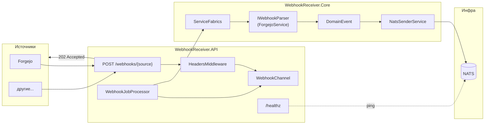
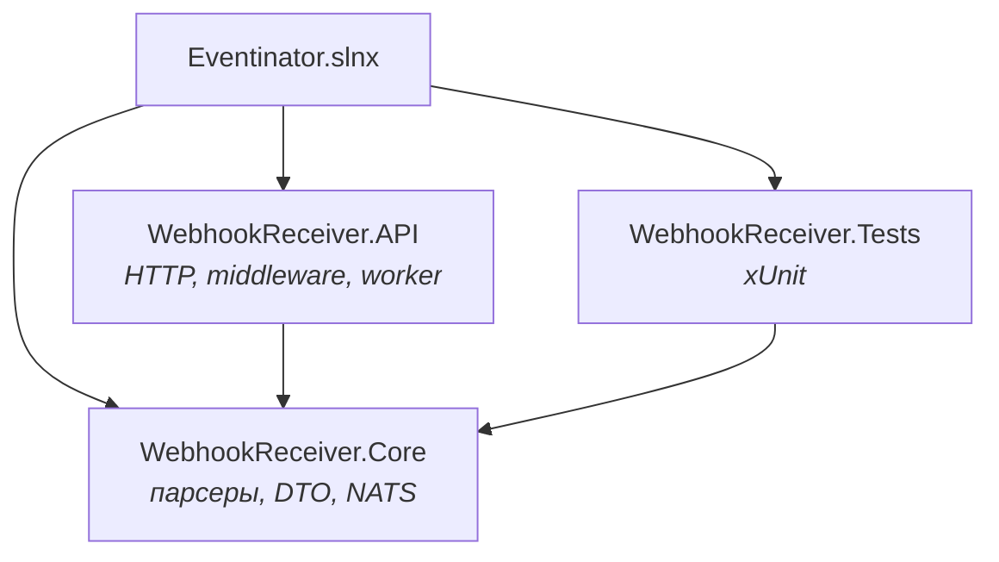

# Eventinator

Небольшой сервис для приёма вебхуков. Берёт HTTP от Forgejo (и потенциально от чего угодно ещё), приводит к одному формату и кидает в NATS.

## Как это работает

Внешняя система шлёт вебхук и ждёт быстрый ответ. Мы отдаём `202 Accepted`, а всё остальное - парсинг, маппинг, публикация в брокер - уходит в фоновый воркер через `System.Threading.Channels`.



По шагам:

1. `POST /webhooks/forgejo` - тело запроса и заголовки `X-*` попадают в `WebhookPayload`
2. Payload кладётся в канал, клиент получает 202
3. `WebhookJobProcessor` забирает из канала, создаёт scope, вызывает `WebhookIngestionService`
4. `ServiceFabrics` находит парсер по `{source}` из URL
5. `NatsSenderService` публикует `DomainEvent` в subject вида `webhooks.forgejo.push`

## Проекты в solution



| Проект | За что отвечает |
|--------|-----------------|
| `WebhookReceiver.API` | эндпоинт, `HeadersMiddleware`, health check, background service |
| `WebhookReceiver.Core` | парсеры, `DomainEvent`, отправка в NATS |
| `WebhookReceiver.Tests` | тесты `ForgejoService` и `ServiceFabrics` |

## Стек

.NET 10, Native AOT, Minimal API (`CreateSlimBuilder`), NATS.Net, source-generated JSON (`JsonSerializerContext`), OpenAPI + Scalar в dev, xUnit + FluentAssertions + Moq.

## Несколько решений, которые мне важны

Парсеры вынесены в `IWebhookParser` - новый источник это новая реализация + регистрация в DI, без правок пайплайна. Сейчас живёт только Forgejo, но фабрика уже умеет выбирать по имени source case-insensitive.

`DomainEvent` - единый контракт для подписчиков: id, source, eventType, сырой JSON, время. NATS-сабджект собирается из префикса и типа события: `webhooks.forgejo.pull_request`.

Логи через `LoggerMessage` + scope с `WebhookId` / `Source` / `EventType` - проще копать, когда что-то пошло не так.

## Запуск

Нужны .NET 10 SDK и NATS. Поднять брокер:

```bash
docker run -d --name nats -p 4222:4222 nats:latest
```

Запуск сервиса:

```bash
dotnet run --project Related/WebhookReceiver.API
```

По умолчанию слушает `http://localhost:5237`. В dev - Scalar на `/scalar/v1`.

Проверка Forgejo push:

```bash
curl -X POST http://localhost:5237/webhooks/forgejo \
  -H "Content-Type: application/json" \
  -H "X-Forgejo-Event: push" \
  -d '{"ref":"refs/heads/main","sender":{"login":"octocat"},"repository":{"name":"repo","full_name":"octocat/repo"}}'
```

Тесты:

```bash
dotnet test
```

Конфиг NATS - в `Related/WebhookReceiver.API/appsettings.json`:

```json
{
  "Nats": {
    "Url": "nats://localhost:4222",
    "SubjectPrefix": "webhooks"
  }
}
```